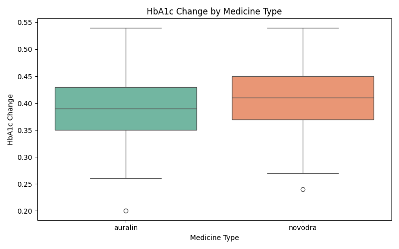
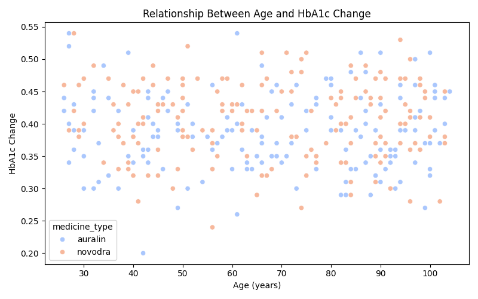

# Auralin Drug Effectiveness Analysis

A data analysis project comparing the efficacy of **Auralin (oral insulin)** 
versus **Novodra (injection)** in HbA1c reduction across 350+ diabetic patients.

> **Note:** This project uses a publicly available practice dataset 
> originally from Udacity's Data Wrangling course. No real patient data is included.

## Background

Auralin is a novel oral insulin formulation developed as an alternative to the 
established injectable form, Novodra. This project evaluates whether Auralin 
achieves comparable glycemic control to Novodra, using HbA1c percentage change 
as the primary outcome — a standard non-inferiority study design used in 
clinical drug development.

## Dataset

- **350+ patient records** from a clinical trial dataset
- **Demographics:** age (27–103), BMI, sex
- **Clinical measurements:** baseline and post-treatment HbA1c levels
- **Treatment groups:** Auralin (oral) vs Novodra (injection)

## Methods

1. **Data cleaning** — handled missing values, merged patient and treatment tables
2. **Feature engineering** — calculated HbA1c percentage change, age group stratification
3. **Exploratory data analysis** — distributions, outlier detection
4. **Comparative analysis** — boxplots and scatterplots stratified by drug, age, BMI

## Key Findings

### 1. Comparable efficacy between drugs

Median HbA1c reduction: **Auralin = 0.39, Novodra = 0.41**. Overlapping 
interquartile ranges support non-inferiority of the oral formulation.



### 2. Consistent response across age groups

Treatment effect remained stable across all age groups (<30 to 75+), 
indicating broad applicability.


### 3. No strong correlation with age or BMI

Drug efficacy does not depend significantly on patient age or BMI.



## Tools Used

- **Python 3.8+**
- **Pandas, NumPy** — data manipulation
- **Matplotlib, Seaborn** — visualization

## How to Reproduce

```bash
git clone https://github.com/AbhijitaBhat/auralin-drug-effectiveness.git
cd auralin-drug-effectiveness
pip install -r requirements.txt
python scripts/diabetic_drug_eda.py
```

## File Structure

```
auralin-drug-effectiveness/
├── data/                      # Cleaned datasets
├── scripts/                   # Analysis code
├── figures/                   # Generated plots
├── requirements.txt
└── README.md
```

## Limitations and Future Work

- BMI values in the dataset show unusual ranges; unit verification recommended
- Formal statistical testing (Mann-Whitney U) planned as next step
- Regression modeling to predict individual patient response is the long-term goal

## Author

**Abhijita Bhat** — MS Bioinformatics, Northeastern University  
📧 bhat.ab@northeastern.edu  
🔗 [LinkedIn](https://www.linkedin.com/in/abhijita-bhat-303027215)
